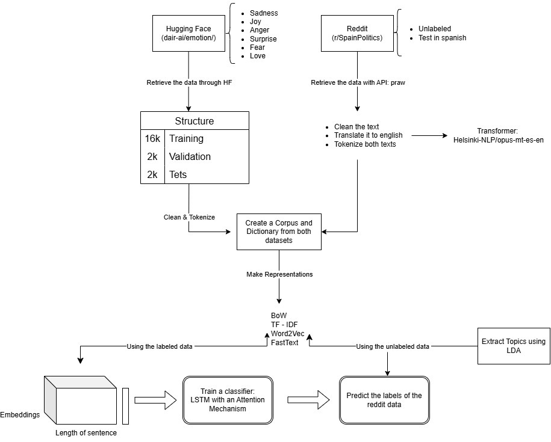
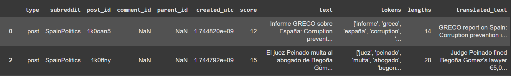

# Machine learning applications: Final Project

## Group Members:
- 100495777: César Ramírez Chaves
- 100496616: Iqbal Chaudhry Mora
- 100496619: Ignacio Torrego Diez

---

## Report Final Project: Analysis of Spain's Political Landscape with Reddit

## Index

1. Introduction

2. Data Collection & Preprocessing  
    * 2.1 Reddit Dataset  
        * 2.1.1 Collection  
        * 2.1.2 Translation  
    * 2.2 Training Dataset

3. Text Vectorization  
    * 3.1 Bag-Of-Words  
    * 3.2 TF-IDF  
    * 3.3 Word2Vec  
    * 3.4 FastText  
    * 3.5 Theme Extraction

4. Classification Task  
    * 4.1 Classic Classification  
        * 4.1.1 BoW  
        * 4.1.2 TF-IDF  
        * 4.1.3 Feature Extraction (PCA)  
            * 4.1.3.1 BoW  
            * 4.1.3.2 TF-IDF  
    * 4.2 Classification with Attention Model  
        * 4.2.1 Word2Vec  
        * 4.2.2 FastText  
        * 4.2.3 Performance Analysis  
    * 4.3 Inference over Reddit Dataset

5. Dashboard

6. Conclusions

7. Authorship

---

Some data could not be upload to the github due to its weight so it is stored in a drive folder with the same structure as it should be in the repository.
LINK: https://drive.google.com/drive/folders/1F5ATLNVgeNH7yDYWsC51JjqTTGtzj-En?usp=sharing

---
## 1. Introduction 
For this project, we conducted an analysis of the public perception of the current Spanish political situation. To achieve our goal, we first needed the datasets from which we were going to start working, which was made possible with a dataset we scraped from the subreddit r/SpainPolitics (https://www.redit.com/r/SpainPolitics/), the main reason why we have chosen this subreddit is due to its size, as it covers a wide range of members from a community which began in 2019, which is the second main reason that made us select this dataset, as it contains one of the most heated moments in recent history of our country. Here we can find topics such as the global pandemic we all suffered back in 2020, COVID-19, we can also find comments about the Ukrainian war that started in february 2022, that has a notable impact in our lives and more recent aspects of our daily life, like the Tariff War, started by the president of the United States of America or the legal cases from the wife of the President of Spain. In order to ensure that we were able to provide an unbiased source of information, we checked that the community had active moderation and guidelines. The primary goal we aim to achieve is to analyze shifts in the general public sentiment over those complicated periods.

If we wanted to make the classification of the collected Reddit text possible, we previously had to train a multi-label classifier, which is designed to give us as output one of the six different emotion categories: sadness, Joy, Anger, Surprise, Love, and Fear. Moreover, as we needed a dataset to first train the classifier, which was obtained from the prelabelled dair-ai/emotion dataset that can be found on Hugging Face (https://huggingface.co/datasets/dair-ai/emotion). 

Finally, the architecture for our classifier, which was chosen, was an LSTM neural network augmented with an attention mechanism. We came to the conclusion that this approach, as the attention mechanism, represents a State-of-the-Art (SOTA) technique in natural language preprocessing, which we thought would significantly enhance the model´s ability to focus on the most relevant parts of the text for accurate emotion classification in this context. 

Disclaimer: 

As politics tends to typically be a sensitive subject, we have tried to be as objective as we possibly can be. The authors of this work have made every effort within their power to ensure neutrality during this analysis from the beginning by recollecting data until the very end, with the interpretation of the results. No personal or political beliefs have been expressed or endorsed by any member of the team in this report. Any opinions that may have been inferred from the results are a reflection of the analyzed content and not of the team conducting the analysis.

# Task 1
## 2. Data Collection & Preprocessing
### 2.1 Reddit Dataset
As it was stated before, we were going to use three datasets, from where two datasets were obtained from Hugging Face, and the remaining one from Reddit, using the Reddit´s API tool for Python: praw (https://praw.readthedocs.io/en/stable/). 

#### 2.1.1 Collection
During this phase, we utilized the praw library to collect post and their comments from the subreddit r/SpainPolitics. It authenticates using API credentials and retrieves up to 10.000 posts, storing each post´s metadata (ID, score, timestamp, and content) in a list. It then gathers all the associated comments for each post and appends their details similarly.
The collected data is then converted into a Pandas DataFrame, where each entry is labeled as either a post or comment. Finally, it filters the data to retain only those posts or comments between 6 and 250 words, preparing it for further analysis.

#### 2.1.2 Translation
Once we have obtained the raw text, we encountered a major problem, and that being that most of the text we have scraped is in Spanish, and the text available in the second dataset, which is going to be used to train the classifier, is in English, so in order to obtain better and more coherent results we decided to translate each one of the 17k documents.

To carry out this task, we loaded a Transformer model from Hugging Face, the Helsinki-NLP/opus-my-es-en (https://huggingface.co/Helsinki-NLP/opus-mt-es-en). We ran the model locally and translated all the text. We decided to go with this option as transformers are State-Of-The-Art models, and we wanted to achieve the best results for our project while ensuring that common expressions were not lost in the translation process of the text.
Here is an example of how the final structure of the scraped text from Reddit looks:

Then, we applied the cleaning and proper tokenization techniques to the text in Spanish, the SpaCy model: es_core_news_md. Here, we wanted to get rid of expressions that contained characters that would affect the process, furthermore, we turned the whole text into lowercase, and finally, we left only the lemma of the words to group semantically similar words, which helps to reduce the feature space and consolidates the word's meaning.
### 2.2 Training Dataset

As it was mentioned before, we have used a pre-labelled dataset that will be used later on for the training of our models. The structure of this dataset is the following:

A splitted (20K rows) and an unsplitted (144K rows) version. For our project, we ended up using the splitted versions, as our machines could not handle the training process with a bigger dataset in a reasonable amount of time. This dataset is divided into 3 parts:

- Train: 16K rows
- Validation: 2K rows
- Test: 2K rows

Also, one of the main reasons why we have chosen this dataset is due to its diverse range of emotions, as it is capable of capturing more than the usual positive/negative sentiment analysis datasets available. The emotions are:

- 0 -> Sadness
- 1 -> Joy
- 2 -> Love
- 3 -> Anger
- 4 -> Fear
- 5 -> Surprise

We then save the lengths of each of the sets for later, as now we want to make a full dataset that will be used later on to obtain both the final corpus and vocabulary for the text representations.

## 3. Text Vectorization
For this next part, we have structured it in the following way:

- Classical BoW and TF-IDF representation
- Word2Vec and FastText-based representation that gives us word embeddings.
- Extraction of themes and vector representation of the Reddit documents using the LDA algorithm.

Each of the mentioned sections is divided into two subsections, the first being the computation of the representation the second one its visualization. As we want to train a model with the labelled dataset to then predict the labels of the unlabelled one, we should make a dictionary that uses all the words present in both datasets.

Both BoW and TF-IDF are made for normal classifiers such as Support Vector Machine, Random Forest and K-means. While Word2Vec and FastText create embedding for each of the words

We created the corpus by combining all tokens from fullDF and redditData. The size of this corpus is 30882 documents where all are used in order when doing the classification there are not words out of vocabulary and there is context of everything. In this dictionary there are 21991 unique terms.

### 3.1 Bag-Of-Words

Our BoW is done using ‘doc2bow’ from gensim. When doing it for the entire corpus, we obtain the work cloud and top words in the corpus seen below. It makes sense that the most used words are the kinds of feel, like, know, or people. This is because, as we are using data from people showing their feelings, it is clear that they express themselves using that kind of language.

### 3.2 TF-IDF 

In this case, TF-IDF is done with ‘TfidfModel’ from gensim.models. We do it with the data bag of words and when we represent it we get a similar word cloud. For the barchart, we decided to analyze a specific example. In this case we selected document 4884, we can see in the graph that the top terms of this document are font, san, color and bitstream.

### 3.3 Word2Vec

We use the function Word2Vec from gensim.models. We use the full corpus with a vector size of 200, which means that each embedding will have 200 variables to represent it. We also put a min count of 10 in order to appear at least 10 times and a window of 5. We can then explore the most_similar function for different terms, it will appear that those terms where the embedding is closest to the one introduced. If we, for example, try “sánchez”, there will appear words of the like of pedro, corrupt or president, which makes sense. Later, we did a TSNE to see where each word would be in the graph based on similarity. It can be seen below.

### 3.4 FastText

For this, we used the function FastText from gensim.models. FastText is very similar to Word2Vec, the only difference is that it is possible to obtain the embeddings of a word, no matter if that word is not in the corpus, because it learns embeddings for character subwords and composes them to form the word’s vector. In this case, we also use a vector size of 200, a min count of 10, and a window size of 5 in order to obtain the same format as with Word2Vec. If we here try the most_similar function with the word “sanchéz”, it will appear terms such as authorize, apology, or racism. These are the terms that our FastText believe are most similar to Sánchez. Finally, we created a TSNE, which can be seen below.

### 3.5 Theme Extraction
For this last section of task 1, we have focused on obtaining the topics from our Reddit dataset, as it is a problem that does not require any label, and it is more convenient to obtain relevant topics from this dataset. Therefore, the corpus is only done with information from the redditData. We created a coherence dictionary to find out what number of topics that would have more coherence. The function proposes 5, but we use 10 in order to have more explainability. We can explore the most relevant words per term, which can be seen in the next wordcloud.

We can detect current trending topics in the political sphere of Spain as topic3 can be related to problems with the current goverment like the rise of prices, for topic 5 might be related to the elections in 2023 as it mentions the words "vote", "pp" and "psoe" which are the main political parties in Spain, topic 6 can be related to the housing problem that most of Spain is facing right now and topic 10 is related to the recent scandal of President Pedro Sanchez wife Begoña Gómez.

# Task 2

## 4. Classification Task

Our approach for the classification was the following:

First we split all the data with its corresponding tf-idf, bow, word2vec and fasttext representation to train two different classes of classifiers:

1. **Classic Classifiers**: We use the BoW and TF - IDF representations to fit a pipeline of SVM, RF and KNN classifiers with hyperparameter selection using k-cross validation.
   
2. **Attention LSTM**: In order to preserve the information from the word embeddings obtained with word2vec and fasttext we used this RNN architecture.

Then we seleceted the best model to predict the labels of our Reddit datset

### 4.1 Classic Classification

For this section we developed the following pipeline. First, we transformed the sparse document-term matrix into a dense format where each row represents a document and each column corresponds to a token from the vocabulary. The dataset was then split into training and testing subsets. To evaluate performance on multi-class classification, the target labels were binarized. We tested three classifiers Support Vector Machine (SVM), k-Nearest Neighbors (KNN), and Random Forest each within a GridSearchCV loop to find the optimal hyperparameters via 3-fold cross-validation. After training, the models were evaluated on the test set using accuracy and macro-averaged AUC (Area Under the ROC Curve). This process was applied to both BoW and TF-IDF representations, and the results were compiled to compare classifier performance and determine the most effective model.

#### 4.1.1 BoW 

After running this pipeline with the BoW representation of our corpus we obtained the following results

#### 4.1.2 TF - IDF

With our Tf-Idf representation

#### 4.1.3 Feature Extraction (PCA)

Given that the results obtained from our TF-IDF were significantly more consistent than  those from the BoW we performed PCA on the Tf-Idf representation to see if we can further enhance this results by reducing the dimensionality.
As we can see in the following plot the recomended number of features using the elbow method was around 20 but as the corpus had around 22k columns we thought it would be a low number of features and testing proved us right:

So we wanted to increase the number of features to around 1000-4000 but this was unfeasable to compute with our machines, it took a lot of time and then the training of the pipeline was incredibly slow so we ended up settling with 100 features, these are the results:

We can see how feature extraction was not useful as it reduced the performance in the test set by a huge amount.
With this we conclude the Classic Classification part of our Classification Task, this was made to illustrate how we can obtain good results with less complex approach like the one we performed in the next section. 

### 4.2 Classification with Attention Model

As our project focuses on analyzing the public perception of Spanish politic landscape through sentiment analysis of text data to achieve this goal, we needed a robust text classification model capable of accurately categorizing noisy and context-dependent text from our Reddit dataset.

#### LSTM

Text data has a sequential structure by nature. The meaning of a sentence often depends not just on individual words but also on their order and how they relate with each other over a sequence. Recurrent Neural Networks (RNNs) were designed to handle such sequential data.

Long Short-Term Memory (LSTM) networks are a specific type of RNN that are particularly effective at learning long-term dependencies in sequences. Standard RNNs may suffer from the vanishing gradient problem, making it difficult for them to remember information from distant past steps in a sequence. LSTMs mitigate this through its gating mechanisms (input, forget, and output gates) that controls the flow of information, allowing them to selectively remember or forget information over the time.

Given the nature of Reddit comments and posts, which can vary in length and complexity, a LSTM's ability to capture these long-range dependencies makes it a strong candidate for understanding the full context of a given text.

Another reason on why we chose this model is the emphasis we gave to the translation of the text from spanish to english using a transformer so context wasn't lost in the process.

#### Enhancing it with Attention

Even though LSTMs are powerful, processing long sequences can still be challenging. A standard LSTM processes information  token by token and produces a final hidden state that is a fixed-size representation of the entire input sequence. This fixed representation can become a bottleneck, especially when dealing with very long texts where different parts of the text might be more relevant to the final classification than others.

This is where the attention mechanism imporves the architecture. Attention allows the model to dynamically assign weights to the importance of different parts of the input sequence when making a prediction. Instead of relying solely on the final hidden state of the LSTM, the attention mechanism computes a weighted sum of the hidden states across the entire sequence, where the weights are learned based on their relevance to the classification task.

#### 4.2.1 Word2Vec

First we fed our NN model with the word2Vec Embeddings and after several rounds of training with different parameter values, we ended up with the following model trained in 27 epochs:
<pre>RNN_attention_with_train(input_size=200, output_size=6, hidden_dim=256, n_layers=4)</pre>

With an accuracy of 0.861 on the test set these are the results of this model

#### 4.2.2 FastText  

For the FastText embeddings we did the same and we obtained these results:

Although the loss plots of both models suggest that further training might improve performance, these were our two best models, and the plots show the loss curves just before overfitting began.

#### 4.2.3 Performance Analysis  

After several trainings of these 2 models we can see how the word2vec one is clearly superior the the one trained using the fasttext representation.

In the following table we show the side by side comparisons of the best models trained in each of the representations:

<table style="width: 80%; border-collapse: collapse; font-size: 18px; margin: 20px auto; text-align: center;">
  <thead>
    <tr style="background-color:rgb(102, 79, 79);">
      <th style="padding: 12px; border: 1px solid #ccc;">Model</th>
      <th style="padding: 12px; border: 1px solid #ccc;">Epochs</th>
      <th style="padding: 12px; border: 1px solid #ccc;">AUC</th>
      <th style="padding: 12px; border: 1px solid #ccc;">Test Accuracy</th>
    </tr>
  </thead>
  <tbody>
    <tr>
      <td style="padding: 12px; border: 1px solid #ccc;"><b>Word2Vec</b></td>
      <td style="padding: 12px; border: 1px solid #ccc;">27</td>
      <td style="padding: 12px; border: 1px solid #ccc;">0.9768</td>
      <td style="padding: 12px; border: 1px solid #ccc;">0.861</td>
    </tr>
    <tr>
      <td style="padding: 12px; border: 1px solid #ccc;"><b>FastText</b></td>
      <td style="padding: 12px; border: 1px solid #ccc;">30</td>
      <td style="padding: 12px; border: 1px solid #ccc;">0.7958</td>
      <td style="padding: 12px; border: 1px solid #ccc;">0.533</td>
    </tr>
  </tbody>
</table> 

### 4.3 Inference over Reddit Dataset

After completing the task of classification we ended up selecting our Attention model trained with the word2vec representations, after obtaining the labels for all of our documents in the Reddit dataset we can see how the predominant sentiment was anger.
In the following plot we can see a side by side comparison on how the general emotions of the forum users was during 2024 and 2025

Lets try to interpret these results. 

* **Anger**: Being the most prevalent in the both years around 50% this overwhelming amount of anger may be due to different factors such as the ongoing political fragmentation of the spanish people with the rise of the right wing in Europe specially in young men which are usually the demographic who populates online forums like *Reddit*, and this can be a signifacant factor to the porcentage of anger as the current goverment is a socialist one. But anger can be also due to the opposition's action during this last year as the mishandling of PP over a crisis like the DANA floods and their slow disaster response. Its slight decrease in 2025 could suggest a decrease over these factors.

* **Joy**: In second place the consistent proportion of joy may suggest that despite all the negative opinions agains the political landscape in Spain there are always consistent sources of positivity, this could be due to positive economic indicators (like the GDP growth and the decline of unemployment a huge problem that has affected Spain for a long time) as well as , also successful policy implementations, or moments of national unity or achievement. The stability in joy levels indicates these positive aspects persisted across both years.

* **Fear**: The emotion with the biggest shift as it increased a 3.2% between 2024 and 2025, this rise could be linked to the growth of uncertainities all around the world. Potential causes of fear among the spanish people could be the always shifting and evolving geopolitical landscape like the war in Ukraine or Palestine and their wider implications. Another cause could be Trumps new tariffs and his unpredictable ways of leadig the largest economy in the world the United States of America. Fear can be found inside of Spain also due to the housing problem, the rise of prices and the cost of living in general.

* **Sadness**: The presence of sadness, though it decreased slightly in 2025, most likely reflects the impact of challenging events the spanish people have faced during these years. One of these causes could be linked to the devastating DANA floods which unfortunately took the lives of 227 people. The aftermath of these events and the recovery efforts in 2025 could still contribute to sadness, though perhaps with less intensity than in the immediate aftermath. Other societal issues or the perceived negative consequences of political decisions could also contribute to this emotion.

* **Love and Surprise**: The low proportions of these emotions are expected as in a political subreddit as they tend to focus on a critical analysis or debate rather than affectionate expressions.

# Task 3
## 5. Dashboard

To conclude this project we developed an interactive dashboard that lets a user interact with the different parts of this project. 
This dashboard has been divided in three parts:

**Sentiment Classifier**: The first part lets the user type a sentence and the dashboard will output the sentiment of that sentence and a plot that shows the weights assigned to each of the tokens in the sentence. This part works on top of our attention model trained in the fasttext embeddings that even though it may not be as accurate as its word2vec counter part the advantage of fasttext is that it lets us input Out-Of-Vocabulary words making possible this part.

**Dataset Emotion Analysis**: Users can select a date range and the app will display both a plot and a piechart with the relative and absolute amounts of post classified for each emotion during that period, users can click on any of the piecharts emotions and a random post with that emotion in that time period will be shown. Next there is a time series plot of the evolution of the number of posts with each label per week. At last in this section the user can select one of the six emotions and the dashboard will display a wordcloud with the most frequent words with posts labelled with that emotion

**Topic Modeling**: First Users can see a histogram showing the distribution of predominant topics across documents, it is fully interactive letting users select the topics they want to see. Finally the last functionality of our dashboard lets the user input a document index and it will display its text, the document information, its predominant topic and a wordcloud of the most relevant words in that topic  

## 6. Conclusions

This project aimed to give a understanding of how is the general perception of the spanish people towards the current political landscape we have in Spain, of course as we lack of proper equipment and data collection tools this results should not be generalized as everything we have done is based on the subreddit r/SpainPolitics, where even though it is supposed to be an *unbiased* platform for political debate we do not have the means to ensure it.

We used all of the knowledge and techniques that we acquired in the *Applications to Machine Learning* course from the handling of the data to the pipelines of classifiers and NLP techniques used all over the project.

Some of the main problems we faced during the development of this project were the following:

* English/Spanish datasets: as our training dataset only contained text in english and our scrapped dataset was mainly in spanish, and translating was a big deal for us, we did not want to loose the context of the texts in spanish as it could lead to a poor performance in the labeling of the data. We took into consideration different alternatives but ended up choosing a pretrained transformer that was ran locally.
* Handling the representations as our datasets were so big our machines could not always support that many data at the same time so we had to remove them and load them when necessary
* Overall technical limitations: As we wanted to make a project that could display the use of current SOTA technologies like attention mechanisms and transformers most of the heavy work was made in 2 machines with 16 Gb of RAM both and GPUS: RTX 3060 and RTX 4060 which lacked the power to handle a bigger dataset for training our models and translating the a much bigger dataset in spanish.

Even though we faced all these problems and limitations we believe this project can showcase how important NLP and ML can be to understanding the world we live in.

## 7. Acknowledgement of authorship

The code developed for this project was created entirely by our team. However, we reused certain components from previous coursework: specifically, some code for NLP-related tasks from the course M2.350.16503-96 MAG. Machine Learning Applications 24/25-S2, and our LSTM attention model, which was adapted from our own finished implementation in a previous assignment for M2.350.16506-96 MAG. Redes Neuronales 24/25-2C.

We have also used Generative AI tools during development (ChatGPT) primarily to assist us  with debugging and improving the visual presentation of our plots. The core structure, logic, and data visualizations were developed by us.

Additionally, we incorporated code snippets and examples from the official Dash documentation to support the development of our interactive dashboard. All external materials have been properly adapted and integrated within the context of our original work.\
We hope you enjoyed our project as much as we enjoyed developing it.

## 8. References

